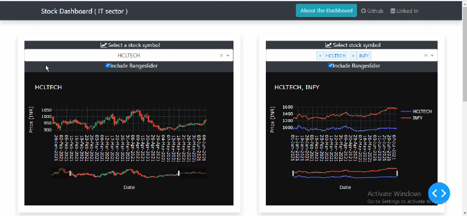

[![Contributors][contributors-shield]][contributors-url]
[![Forks][forks-shield]][forks-url]
[![Stargazers][stars-shield]][stars-url]
[![Issues][issues-shield]][issues-url]
[![MIT License][license-shield]][license-url]
[![LinkedIn][linkedin-shield]][linkedin-url]


<!-- PROJECT LOGO -->
<br />
<p align="center">
  <a href="https://github.com/SumitMahar/dash">
    
  </a>

  <h3 align="center">Stock Dashboard</h3>

  <p align="center">
    An interactive web-dashboard for analyzing stocks.
    <br />
    <a href="https://github.com/sumitmahar/dash"><strong>Built with Python (dash-plotly) »</strong></a>
    <br />
    <br />
    <a href="https://nse-dashboard.herokuapp.com">Live Demo</a>
    ·
    <a href="https://github.com/sumitmahar/dash/issues">Report Bug</a>
    ·
    <a href="https://github.com/sumitmahar/dash/issues">Request Feature</a>
  </p>
</p>


<!-- TABLE OF CONTENTS -->
<details open="open">
  <summary>Table of Contents</summary>
  <ol>
    <li>
      <a href="#about-the-project">About The Project</a>
      <ul>
        <li><a href="#built-with">Built With</a></li>
      </ul>
    </li>
    <li>
      <a href="#getting-started">Getting Started</a>
      <ul>
        <li><a href="#installation">Installation</a></li>
      </ul>
    </li>
    <li><a href="#potential-future-developments ">Potential Future Developments</a></li>
    <li><a href="#license">License</a></li>
    <li><a href="#demo">Live Demo</a></li>
    <li><a href="#contact">Contact</a></li>
  </ol>
</details>


<!-- ABOUT THE PROJECT -->
## About The Project

* Select a stock symbol from the dropdown menu to visualize the data.
* Use Rangeslider to go to a specific timeframe.




* #### Select multiple symbols to compare the data


### Built With

Major languages, frameworks and packages used:
* [Python](https://python.org)
* [Dash-Plotly](dash.plot.ly)
* [Bootstrap](https://getbootstrap.com)


<!-- GETTING STARTED -->
## Getting Started

To get a local copy up and running follow these simple example steps.


### Installation

1. Clone the repo
   ```sh
   git clone https://github.com/SumitMahar/dash.git
   ```
2. Install packages with pipenv or pip
   ```sh
   pipenv install -r requirements.txt
   ```
3. Run `app.py` from command line  with python 
   ```sh
   python app.py
   ```


<!-- USAGE EXAMPLES -->
## Potential Future Developments 
* Indicators for Candlestick chart
* Daily auto-updates
* machine learning predictions


<!-- LICENSE -->
## License

Distributed under the MIT License. See [`LICENSE`](https://github.com/sumitmahar/dash/master/LICENSE.txt) for more information.

<!-- Project Demo link -->
## Live Demo 

`https://nse-dashboard.herokuapp.com/`


<!-- CONTACT -->
## Contact

Email - Sumitmahar78@gmail.com

Project Link: [https://github.com/sumitmahar/dash](https://github.com/sumitmahar/dash)


<!-- MARKDOWN LINKS & IMAGES -->
<!-- https://www.markdownguide.org/basic-syntax/#reference-style-links -->
[contributors-shield]: https://img.shields.io/github/contributors/sumitmahar/dash.svg?style=for-the-badge
[contributors-url]: https://github.com/sumitmahar/dash/graphs/contributors
[forks-shield]: https://img.shields.io/github/forks/sumitmahar/dash.svg?style=for-the-badge
[forks-url]: https://github.com/sumitmahar/dash/network/members
[stars-shield]: https://img.shields.io/github/stars/sumitmahar/dash.svg?style=for-the-badge
[stars-url]: https://github.com/sumitmahar/dash/stargazers
[issues-shield]: https://img.shields.io/github/issues/sumitmahar/dash.svg?style=for-the-badge
[issues-url]: https://github.com/sumitmahar/dash/issues
[license-shield]: https://img.shields.io/github/license/sumitmahar/dash.svg?style=for-the-badge
[license-url]: https://github.com/sumitmahar/dash/master/LICENSE.txt
[linkedin-shield]: https://img.shields.io/badge/-LinkedIn-black.svg?style=for-the-badge&logo=linkedin&colorB=555
[linkedin-url]: https://linkedin.com/in/sumit-mahar
[product-screenshot]: assets/logo.png